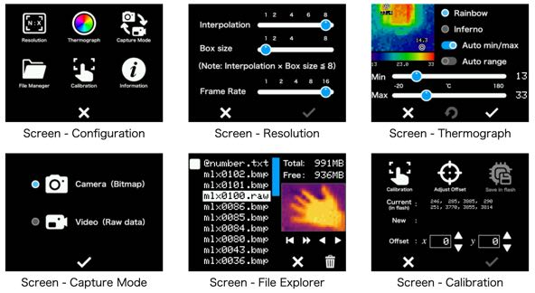
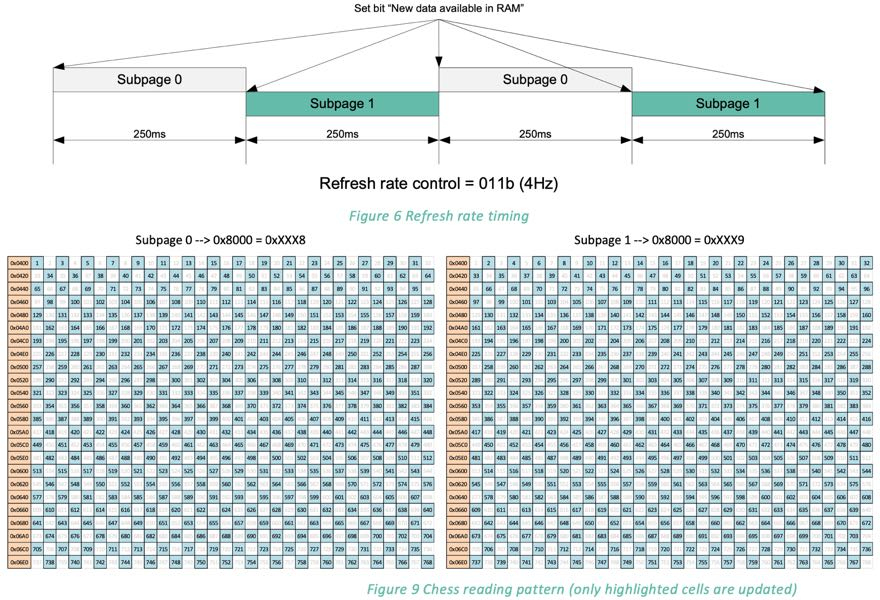
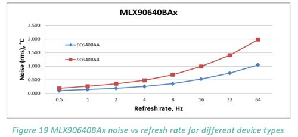
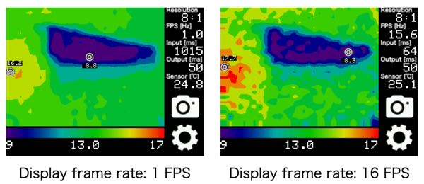
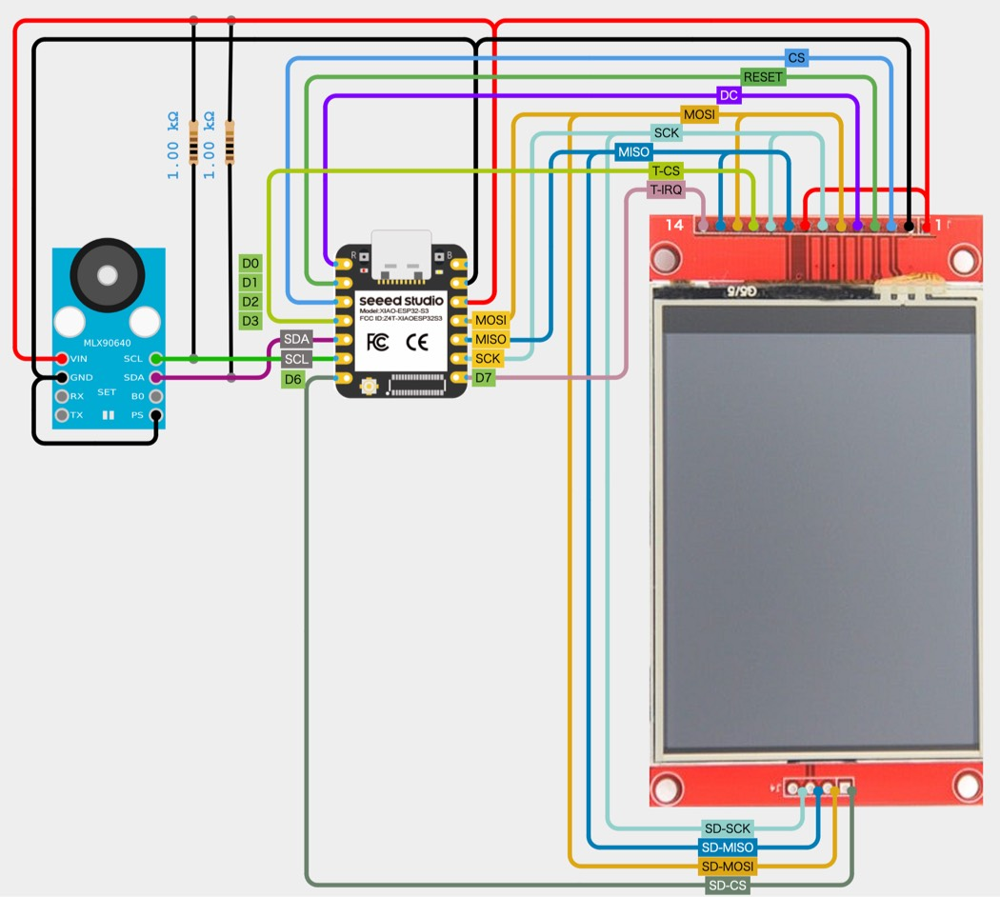
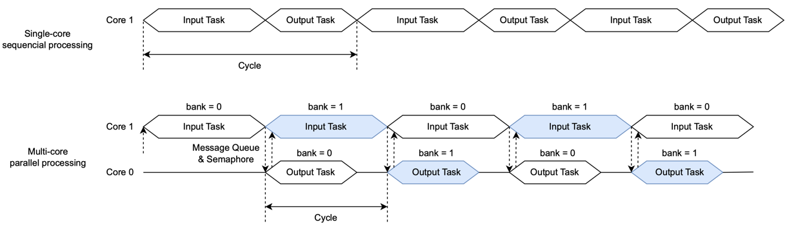
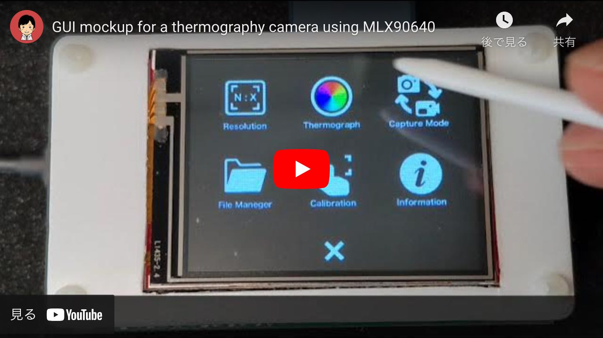

# MLX90640 Thermography Camera by XIAO ESP32S3

## Features

### GUI menu

It comes with a graphical user interface to properly configure the MLX90640 for different scenarios.

- Display frame rate: 1 FPS (min) / 16 FPS (max)
- Resolution: 32 x 24 (min) / 256 x 192 (max)
- Heat map mode: Rainbow / Inferno
- Measurement range: Auto scaling / Manual adjustment.
- Measurement features: Automatic min/max / a specified point.
- Touch screen: Calibration on the first launch / in the configuration menu.
- Screen capture: Save 320 x 240 bitmap (24-bit) to SD card.
- Video recording: Record 32 x 24 raw data continuously onto SD card.
- File explorer: Display thumbnails / Play videos on SD card.
- Offline video viewer: Offline video playback on PC

### Display Frame Rate and Accuracy

The MLX90640 creates a single image by combining two sub-pages exposed at separate exposures, each of which is set by the refresh rate. So for example a refresh rate of `MLX90640_32_HZ` (= `6`) will result in a displayed actual frame rate of half that, 16 FPS.

- From [Melexis MLX90640 datasheet][2]:  
  

A higher refresh rate will allow you to capture images that are more tolerant of motion, but it will also shorten the exposure time, resulting in more noise and less accuracy.

- From [Melexis MLX90640 datasheet][2]:  
  

Therefore, it is necessary to set an appropriate frame rate according to the object being observed.

- Display frame rate of 16 FPS (refresh rate 32 Hz) is noisier than 1 FPS:  
  

### Offline raw data viewer

The recorded raw data can be played back either on the camera itself or using [MLX90640Viewer][18] on a PC.

- [MLX90640Viewer][18]  
  

## Hardware requirements

- [Melexis MLX90640][1]
  - [Datasheet][2]
    - I2C Frequency: 1MHz (Fast mode+)
  - [Breakout board: GY-MCU90640][3]
    - [Alliexpress][4]

- [Seeed Studio XIAO ESP32S3][5]
  - Configuration
    - Partition Scheme: Default with spiffs (3MB APP/1.5MB SPIFFS)
    - PSRAM: OPI PSRAM
  - [ESP32-S3 Series Datasheet][6]
  - [ESP32 Technical Reference Manual][7]

- [2.4" 240 x 320 TFT LCD with resistive touchscreen / SD card I/F][8]
  - [Alliexpress][9]
  - Interface: SPI
  - Display driver chip: ST7789
  - Touchscreen driver chip: XPT2046

## Software requirements

- [Arduino IDE][10] 2.3.4
- [ESP32 board package (by Espressif)][11] 3.1.0
- [Adafruit_MLX90640 (by Adafruit)][12] 1.1.1
- [LovyanGFX (by lovyan03)][13] 1.2.0
- [TFT_eSPI (by Bodmer)][14] 2.5.43
- [PNGdec (by Larry Bank)][15] 1.0.3 (only for TFT_eSPI)
- [espressif/arduino-esp32/libraries/SD][16]
- [SdFat (by Bill Greiman)][17] 2.2.3

**Note:** The TFT_eSPI version has an issue where images cannot be recorded to the SD card.

## Block diagram

- Block diagram  
  

## Wiring diagram

- [Wiring (cirkitdesigner.com)](https://app.cirkitdesigner.com/project/837fd6ec-a7d8-4381-a41f-4b953adefee0 "Cirkit Designer IDE")  
  

## Timing diagram

It utilizes multi-core with FreeRTOS.

- [Timing diagram (Drawio)](https://drive.google.com/file/d/1W-xelIn-PvofRw0Ya43I02ksVurOTiDk/view?usp=sharing)  
  

## Demo

- [MLX90640 GUI mockup][19]  
  

[1]: https://www.melexis.com/en/product/MLX90640/Far-Infrared-Thermal-Sensor-Array "Far Infrared Thermal Sensor Array (32x24 RES) I Melexis"

[2]: https://www.melexis.com/en/documents/documentation/datasheets/datasheet-mlx90640 "Datasheet for MLX90640 I Melexis"

[3]: https://github.com/vvkuryshev/GY-MCU90640-RPI-Python/blob/master/GY_MCU9064%20user%20manual%20v1.pdf "vvkuryshev/GY-MCU90640-RPI-Python: The script to connect the thermal image module GY-MCU90640 to Raspberry Pi."

[4]: https://www.aliexpress.com/item/1005006674751991.html

[5]: https://wiki.seeedstudio.com/xiao_esp32s3_getting_started/ "Getting Started with Seeed Studio XIAO ESP32S3 (Sense) - Seeed Studio Wiki"

[6]: https://www.espressif.com/sites/default/files/documentation/esp32-s3_datasheet_en.pdf

[7]: https://www.espressif.com/sites/default/files/documentation/esp32_technical_reference_manual_en.pdf

[8]: http://www.lcdwiki.com/2.4inch_SPI_Module_ILI9341_SKU:MSP2402 "2.4inch SPI Module ILI9341 SKU:MSP2402 - LCD wiki"

[9]: https://www.aliexpress.com/item/1005006198656280.html

[10]: https://www.arduino.cc/en/software "Software - Arduino"

[11]: https://github.com/espressif/arduino-esp32 "espressif/arduino-esp32: Arduino core for the ESP32"

[12]: https://github.com/adafruit/Adafruit_MLX90640 "adafruit/Adafruit_MLX90640: MLX90640 library functions"

[13]: https://github.com/lovyan03/LovyanGFX "lovyan03/LovyanGFX: SPI LCD graphics library for ESP32 (ESP-IDF/ArduinoESP32) / ESP8266 (ArduinoESP8266) / SAMD51(Seeed ArduinoSAMD51)"

[14]: https://github.com/Bodmer/TFT_eSPI "Bodmer/TFT_eSPI: Arduino and PlatformIO IDE compatible TFT library optimised for the Raspberry Pi Pico (RP2040), STM32, ESP8266 and ESP32 that supports different driver chips"

[15]: https://github.com/bitbank2/PNGdec "bitbank2/PNGdec: An optimized PNG decoder suitable for microcontrollers and PCs"

[16]: https://github.com/espressif/arduino-esp32/tree/master/libraries/SD "arduino-esp32/libraries/SD at master · espressif/arduino-esp32"

[17]: https://github.com/greiman/SdFat "greiman/SdFat: Arduino FAT16/FAT32 exFAT Library"

[18]: https://github.com/embedded-kiddie/MLX90640Viewer "embedded-kiddie/MLX90640Viewer: MLX90640 Raw Filer Viewer"

[19]: https://github.com/embedded-kiddie/Arduino-XIAO-ESP32/tree/main/MLX90640_GUI_mockup "Arduino-XIAO-ESP32/MLX90640_GUI_mockup at main · embedded-kiddie/Arduino-XIAO-ESP32"
