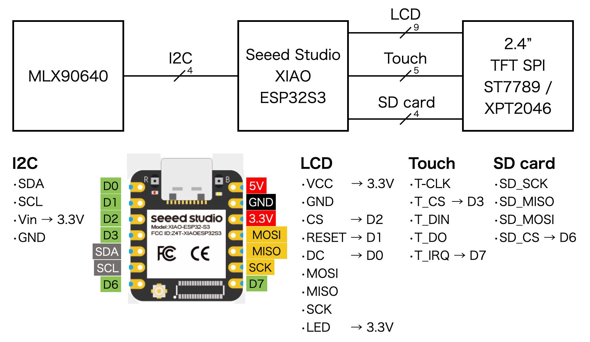
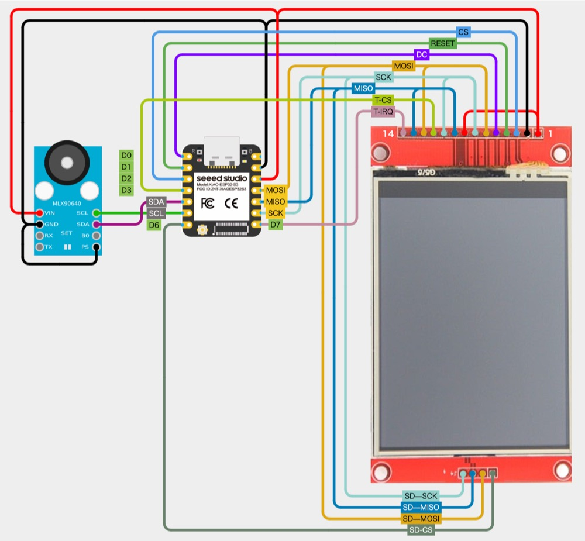

# MLX90640 Thermography Camera by XIAO ESP32S3

## Block diagram

## Wiring diagram

[Wiring at cirkitdesigner.com](https://app.cirkitdesigner.com/project/837fd6ec-a7d8-4381-a41f-4b953adefee0 "Cirkit Designer IDE")

## Timing diagram

[Drawio](https://drive.google.com/file/d/1W-xelIn-PvofRw0Ya43I02ksVurOTiDk/view?usp=sharing)

## Testbed environment

- [Arduino IDE 2.3.2][1]
- [Seeed Studio XIAO ESP32S3][2]
  - ESP32 board package: [espressif/arduino-esp32][3] ([3.0.4][4])
  - PSRAM: Disable
- LCD Display: ST7789 and XPT2046
  - Interface: SPI
  - SPI frequency: 80MHz
  - SPI bus host: SPI2_HOST ([sdspi_host.h][5])
  - [AliExpress][6]
- [MLX90640][7]
  - I2C Frequency: 1MHz (Fast mode+)
  - [Aliexpress][8]

## Dependencies

- Graphic libraries
  - [adafruit/Adafruit-GFX-Library][18]
  - [moononournation/Arduino_GFX][19]
  - [lovyan03/LovyanGFX][20]
  - [Bodmer/TFT_eSPI][21]
  - [bitbank2/PNGdec][22] (only for `TFT_eSPI`)

- Touch screen library (only for `Adafruit-GFX-Library` and `Arduino_GFX`)
  - [PaulStoffregen/XPT2046_Touchscreen][13]

- SD card libraries
  - [espressif/arduino-esp32/libraries/SD][14]
  - [greiman/SdFat][17]

- [adafruit/Adafruit_MLX90640][11]  
  MLX90640 library functions by Adafruit.

## Related resources

- [**Far infrared thermal sensor array (32x24 RES)**][9]  
  Melexi.com MLX90640 product page.

- [**GY-MCU90640 user manual**][10]  
  Official or private user manual of MLX90640 camera module.

- [**sparkfun/SparkFun_MLX90640_Arduino_Example**][12]  
  MLX90640 examples by SparkFun.

- [**ESP32-S3 Series Datasheet**][15]

- [**ESP32 Technical Reference Manual**][16]

[1]: https://www.arduino.cc/en/software "Software - Arduino"

[2]: https://wiki.seeedstudio.com/xiao_esp32s3_getting_started/ "Getting Started with Seeed Studio XIAO ESP32S3 (Sense) - Seeed Studio Wiki"

[3]: https://github.com/espressif/arduino-esp32 "espressif/arduino-esp32: Arduino core for the ESP32"
[4]: https://github.com/espressif/arduino-esp32/releases/tag/3.0.4 "Release Arduino Release v3.0.4 based on ESP-IDF v5.1.4+ · espressif/arduino-esp32"

[5]: https://github.com/espressif/esp-idf/blob/master/components/esp_driver_sdspi/include/driver/sdspi_host.h#L23-L29 "esp-idf/components/esp_driver_sdspi/include/driver/sdspi_host.h at master · espressif/esp-idf"

[6]: https://www.aliexpress.com/item/1005006198656280.html

[7]: https://www.melexis.com/en/documents/documentation/datasheets/datasheet-mlx90640 "Datasheet for MLX90640 I Melexis"

[8]: https://www.aliexpress.com/item/1005006674751991.html

[9]: https://www.melexis.com/en/product/MLX90640/Far-Infrared-Thermal-Sensor-Array "Far Infrared Thermal Sensor Array (32x24 RES) I Melexis"

[10]: https://github.com/vvkuryshev/GY-MCU90640-RPI-Python/blob/master/GY_MCU9064%20user%20manual%20v1.pdf "vvkuryshev/GY-MCU90640-RPI-Python: The script to connect the thermal image module GY-MCU90640 to Raspberry Pi."

[11]: https://github.com/adafruit/Adafruit_MLX90640 "adafruit/Adafruit_MLX90640: MLX90640 library functions"

[12]: https://github.com/sparkfun/SparkFun_MLX90640_Arduino_Example "sparkfun/SparkFun_MLX90640_Arduino_Example: Controlling and reading from the MLX90640 IR array thermal imaging sensor"

[13]: https://github.com/PaulStoffregen/XPT2046_Touchscreen "PaulStoffregen/XPT2046_Touchscreen: Touchscreen Arduino Library for XPT2046 Touch Controller Chip"

[14]: https://github.com/espressif/arduino-esp32/tree/master/libraries/SD "arduino-esp32/libraries/SD at master · espressif/arduino-esp32"

[15]: https://www.espressif.com/sites/default/files/documentation/esp32-s3_datasheet_en.pdf
[16]: https://www.espressif.com/sites/default/files/documentation/esp32_technical_reference_manual_en.pdf

[17]: https://github.com/greiman/SdFat "greiman/SdFat: Arduino FAT16/FAT32 exFAT Library"

[18]: https://github.com/adafruit/Adafruit-GFX-Library "adafruit/Adafruit-GFX-Library: Adafruit GFX graphics core Arduino library, this is the &#39;core&#39; class that all our other graphics libraries derive from"

[19]: https://github.com/moononournation/Arduino_GFX "moononournation/Arduino_GFX: Arduino GFX developing for various color displays and various data bus interfaces"

[20]: https://github.com/lovyan03/LovyanGFX "lovyan03/LovyanGFX: SPI LCD graphics library for ESP32 (ESP-IDF/ArduinoESP32) / ESP8266 (ArduinoESP8266) / SAMD51(Seeed ArduinoSAMD51)"

[21]: https://github.com/Bodmer/TFT_eSPI "Bodmer/TFT_eSPI: Arduino and PlatformIO IDE compatible TFT library optimised for the Raspberry Pi Pico (RP2040), STM32, ESP8266 and ESP32 that supports different driver chips"

[22]: https://github.com/bitbank2/PNGdec "bitbank2/PNGdec: An optimized PNG decoder suitable for microcontrollers and PCs"
